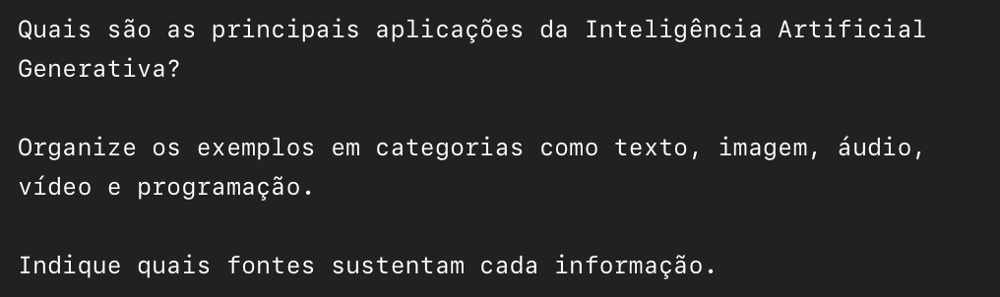
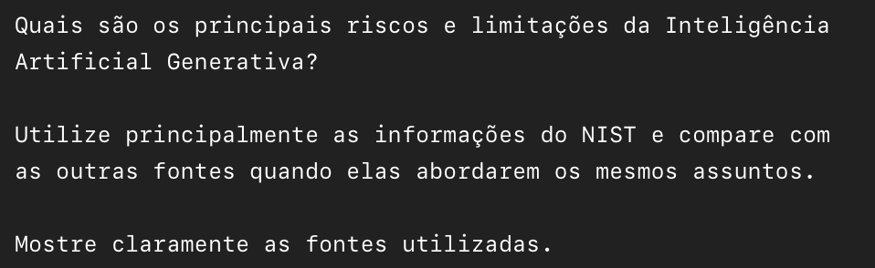
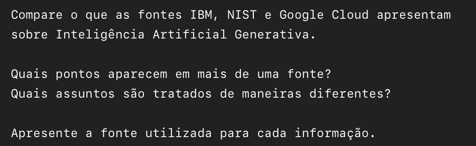
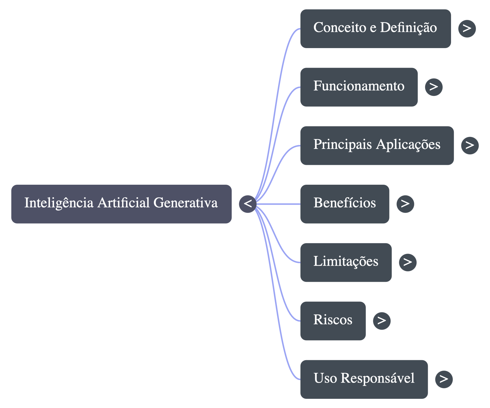

# Segundo Cérebro — IA Generativa

## Tema e objetivo

**Tema:** Inteligência Artificial Generativa.

**Objetivo:** Utilizar um notebook como um "segundo cérebro" para estudar Inteligência Artificial Generativa, organizando informações de diferentes fontes confiáveis em um único local.

O estudo aborda conceitos, funcionamento, aplicações, benefícios, limitações, riscos e uso responsável da IA generativa.

## Notebook

O notebook foi utilizado para consultar as fontes selecionadas, fazer perguntas sobre o tema e gerar materiais de estudo.

[ Acessar o Gemini Notebook](https://notebook.google.com/notebook/d64a45f5-dcc4-4caf-b05c-ede7cc5f348e)

## Fontes utilizadas e por que confio nelas

Foram selecionadas fontes de diferentes formatos e instituições para reunir informações sobre diferentes aspectos da IA generativa.

- **IBM — "O que é a IA generativa?":** empresa de tecnologia com atuação e pesquisa próprias em IA, com material didático e atualizado. Utilizada para conceitos, funcionamento, aplicações e benefícios.
- **NIST — Artificial Intelligence Risk Management Framework: Generative AI Profile (NIST AI 600-1):** órgão oficial de padrões e tecnologia dos EUA, com publicação técnica sobre IA generativa. Adicionado ao notebook em dois formatos (página web e PDF). Utilizado para a definição técnica, riscos, limitações, confiabilidade e governança.
- **Google Cloud — "Generative AI":** documentação oficial de uma das empresas que desenvolvem essa tecnologia. Utilizada para conceitos fundamentais e aplicações práticas.

As informações e links completos das fontes estão disponíveis em:
[ Ver fontes utilizadas](fontes/fontes.md)

## Diretriz de comportamento do notebook

O notebook foi configurado para utilizar somente as fontes adicionadas como base para as respostas.

A orientação utilizada foi:

> Atue como um especialista em Inteligência Artificial Generativa e como meu auxiliar de estudos.
> Utilize somente as fontes adicionadas ao notebook como base para responder às perguntas.
> Indique claramente de qual fonte cada informação foi retirada.
> Não invente informações que não estejam apoiadas pelas fontes.
> Quando mais de uma fonte tratar do mesmo assunto, compare as informações apresentadas e deixe claras possíveis diferenças.
> Explique os conceitos de maneira simples e objetiva.
> Priorize as informações presentes nas fontes adicionadas.

## Perguntas e evidências

Cada resposta do notebook foi longa, por isso os prints completos de cada uma estão organizados em uma pasta própria.

### 1. O que é Inteligência Artificial Generativa?

**Pergunta:** conceito de IA Generativa e seu funcionamento, com uma explicação simples e outra mais técnica.

**O que o notebook respondeu:**
- **Conceito:** é um ramo da IA capaz de criar conteúdos inéditos (texto, imagem, vídeo, áudio, código) a partir de um comando em linguagem natural, o *prompt*. Tecnicamente, é uma classe de modelos de *Deep Learning* que emula a estrutura estatística dos dados de entrada para gerar conteúdo sintético.
- **Funcionamento:** três fases: treinamento (aprende padrões a partir de grandes volumes de dados), ajuste (*fine-tuning* e RLHF) e geração (prevê a resposta mais provável). Por ser estatística, pode gerar falsas afirmações com confiança, chamadas de *alucinação* (IBM) ou *confabulação* (NIST). A técnica RAG ajuda a reduzir isso consultando bases externas.
- **Evolução das arquiteturas:** VAEs (2013), GANs (2014), modelos de difusão (2014) e Transformers (2017).
- **Aplicações em software:** geração e autocompletamento de código, modernização de sistemas legados e agentes de IA.

**Fontes citadas:** IBM, NIST (AI 600-1 e AI RMF Generative AI Profile) e Google Cloud.


 [Ver prints completos da resposta](evidencias/resposta-01/)

### 2. Quais são as principais aplicações da IA Generativa?

**Pergunta:** principais aplicações da IA Generativa, organizadas em categorias (texto, imagem, áudio, vídeo e programação), indicando as fontes que sustentam cada informação.

**O que o notebook respondeu:**
- **Texto:** redação de artigos, e-mails, relatórios e resumos, além de chatbots e agentes virtuais para atendimento ao cliente. Impulsionado por LLMs baseados em Transformers.
- **Imagem:** criação de arte e imagens a partir de *prompts*, transferência de estilo e extração de texto de imagens. Usa GANs, VAEs e modelos de difusão.
- **Áudio:** síntese de fala (Text-to-Speech), transcrição (Speech-to-Text), narração de audiobooks e composição musical.
- **Vídeo:** geração de animações e vídeos curtos a partir de texto, efeitos especiais, edição e *storyboards*.
- **Programação:** geração e autocompletamento de código, testes unitários, depuração, tradução entre linguagens e modernização de sistemas legados.
- **Outras aplicações:** descoberta de moléculas e imagens médicas sintéticas, dados sintéticos que protegem informações pessoais, e criação de avatares e cenários para jogos.

**Fontes citadas:** IBM, Google Cloud e NIST (AI 600-1). Mapeamento por categoria:

| Categoria | Fontes |
|---|---|
| Texto | IBM, Google Cloud e NIST |
| Imagem | IBM, Google Cloud e NIST |
| Áudio / Música | IBM e Google Cloud |
| Vídeo | Google Cloud e IBM |
| Programação | IBM e Google Cloud |
| Dados sintéticos / Saúde | IBM e NIST |



 [Ver prints completos da resposta](evidencias/resposta-02/)

### 3. Quais são os principais riscos e limitações?

**Pergunta:** principais riscos e limitações da IA Generativa, usando principalmente o NIST e comparando com as outras fontes quando tratam dos mesmos assuntos, mostrando claramente as fontes.

**O que o notebook respondeu:**
- **Imprecisões e erros:** o NIST usa o termo *confabulação* e a IBM usa *alucinação*. Ambos descrevem o modelo gerando informações falsas com aparência confiável, por causa da previsão estatística do próximo *token*. A IBM cita o caso de um advogado que usou IA e recebeu processos judiciais inventados.
- **Cibersegurança:** a IA facilita ataques (criação de *malware* e *phishing*) e amplia a superfície de ataque com injeção de prompt e envenenamento de dados. A IBM confirma o risco de *phishing* e identidades falsas.
- **Privacidade e propriedade intelectual:** dados de treinamento podem incluir informações pessoais e conteúdo protegido por direitos autorais. A IBM destaca o risco nos dois sentidos: vazamento de segredos nos prompts e violação de propriedade intelectual no conteúdo gerado.
- **Vieses, homogeneização e colapso do modelo:** perpetuação de preconceitos, perda de diversidade de conteúdo e degradação de modelos treinados com dados sintéticos de outras IAs. A IBM reconhece o problema dos vieses.
- **Fatores humanos:** antropomorfização, excesso de confiança nas respostas (viés de automação) e dependência emocional.
- **Impacto ambiental:** alto consumo de energia e recursos. O notebook informou que IBM e Google Cloud não detalham métricas ambientais nos trechos analisados.
- **Cadeia de suprimentos de TI:** uso de modelos e dados de terceiros dificulta a rastreabilidade e a responsabilização por falhas.

**Fontes citadas:** NIST (AI 600-1) como fonte principal, IBM como fonte complementar (alucinação, propriedade intelectual e *phishing*) e Google Cloud (infraestrutura de segurança e governança em nuvem).



 [Ver prints completos da resposta](evidencias/resposta-03/)

### 4. Comparação entre as fontes

**Pergunta:** comparação entre IBM, NIST e Google Cloud: pontos que aparecem em mais de uma fonte, assuntos tratados de maneiras diferentes e a fonte de cada informação.

**O que o notebook respondeu:**
- **Pontos em comum:** as três fontes concordam sobre a definição de IA generativa (modelos de *Deep Learning* que criam conteúdo a partir de *prompts*), o papel na engenharia de software (geração de código, testes e modernização de sistemas legados) e os riscos de segurança e privacidade (dados pessoais, injeção de prompt, direitos autorais). IBM e Google Cloud destacam os agentes autônomos. IBM e NIST destacam o ajuste fino e o RAG.
- **Erros do modelo:** a IBM usa *alucinação*, com um exemplo jurídico e *guardrails*. O NIST adota *confabulação*, por considerar que "alucinação" antropomorfiza a máquina. A Google Cloud foca no raciocínio dos modelos multimodais e na ancoragem de dados.
- **Escopo de cada fonte:** a IBM é conceitual e voltada a negócios, com histórico das redes neurais, do ELIZA (1964) aos Transformers (2017). O NIST é normativo e de governança de riscos (AI RMF). A Google Cloud é prática e de plataforma, com produtos como o Gemini Code Assist e o Gemini Enterprise Agent Platform.
- **Modelos de fundação e custo:** a IBM destaca o alto custo de treinar um modelo do zero e sugere modelos de código aberto. O NIST define os "modelos de fundação de duplo uso" e foca nos riscos sistêmicos.
- **Impacto ambiental:** o NIST é a única das fontes a tratá-lo explicitamente como categoria de risco.

**Fontes citadas:** IBM, NIST e Google Cloud, com mapeamento por tema:

| Tema | IBM | NIST | Google Cloud |
|---|---|---|---|
| Erros da IA | Alucinação (casos práticos) | Confabulação (visão estatística e riscos) | Ancoragem em nuvem e raciocínio |
| Geração de código | Refatoração e sistemas legados | Revisão de riscos em código gerado | Gemini Code Assist / IDEs |
| Agentes autônomos | Próximo passo da IA generativa | Relação humano-IA e governança | Enterprise Agent Platform |
| Enfoque do material | Pedagógico e de negócios | Normativo e de risco (AI RMF) | Infraestrutura e produtos |



 [Ver prints completos da resposta](evidencias/resposta-04/)

## Materiais gerados

Durante o estudo foram utilizados os recursos de geração de materiais disponíveis no notebook.

- [ Mapa mental](materiais/mapa-mental.png): principais conceitos estudados, incluindo conceito, funcionamento, aplicações, benefícios, limitações, riscos e uso responsável.
- [ Slides (PDF)](materiais/slides.pdf): apresentação com os principais conteúdos estudados sobre IA Generativa.



## Estrutura do projeto

```
segundo-cerebro-ia-generativa/
│
├── README.md
│
├── fontes/
│   └── fontes.md
│
├── materiais/
│   ├── mapa-mental.png
│   └── slides.pdf
│
└── evidencias/
    ├── pergunta-01.png
    ├── pergunta-02.png
    ├── pergunta-03.png
    ├── pergunta-04.png
    ├── resposta-01/
    ├── resposta-02/
    ├── resposta-03/
    └── resposta-04/
```
